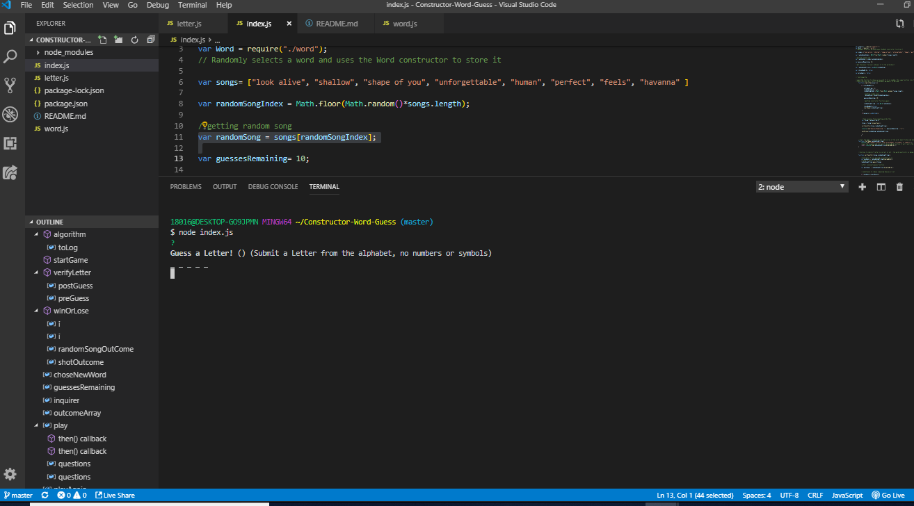
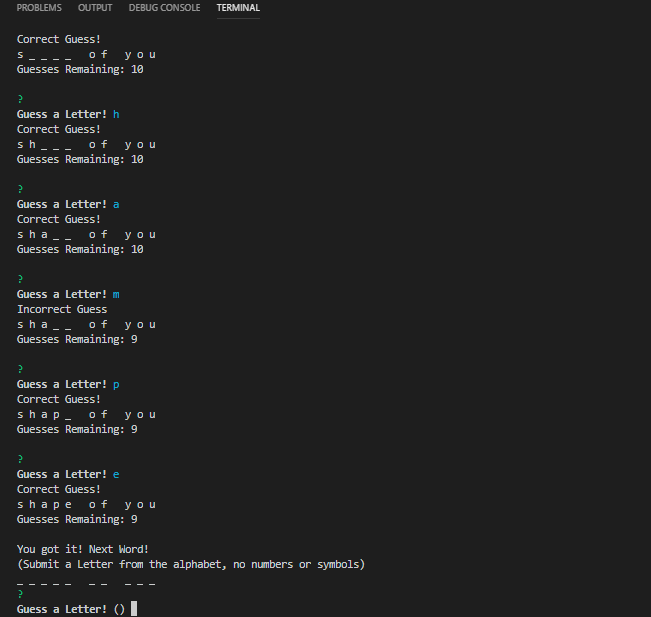
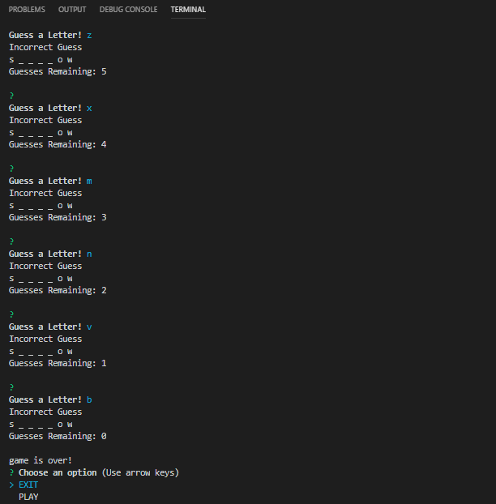
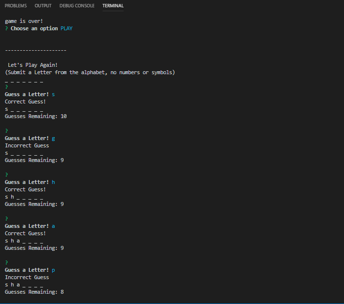
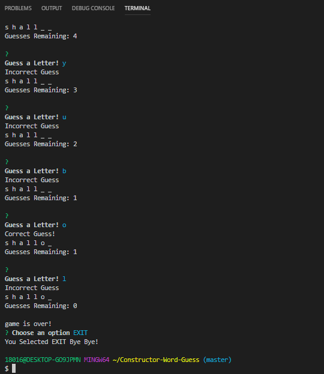

# Constructor-Word-Guess

This is a Command Line Interface (CLI) . It is intended to be a Command Line game where the player will guess a letter at a time. The Goal is to complete the hidden word. 

This project has the inquirer node manager package installed. And it is required to store the player answers and in that way respond accordinly. 

To start the game in the command Line enter: node index.js and the questions will be prompt. If you lose it will give you the options to restart the game or exit. 

Developer: Ginna Campbell
Technologies applied: Node.js

*Example on how to run this code in the Command Line:*

*node node index.js*

*Guess a Letter! () (Submit a Letter from the alphabet, no numbers or symbols)*
*_ _ _   _ _*

*Guess a Letter! s*
*Correct Guess!*
*s _ _   _ _*
*Guesses Remaining: 10*

